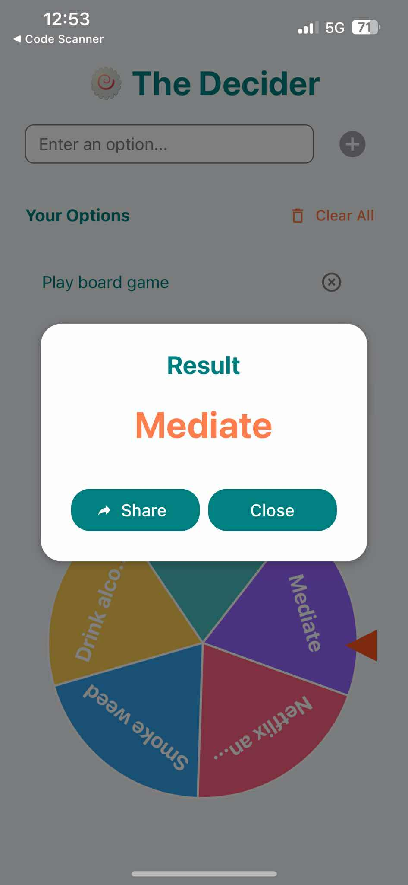

# The Decider

A modern, intuitive mobile application built with React Native and Expo that helps users make decisions through an interactive and engaging interface.

## Preview of App

## Features

- Interactive decision-making interface
- Smooth animations and transitions
- Modern UI/UX design
- Cross-platform compatibility (iOS & Android)
- Offline functionality
- Haptic feedback for better user experience

## Tech Stack

- React Native
- Expo
- TypeScript
- Framer Motion
- Lottie for animations
- React Native Paper for UI components

## Demo Screenshots

    
    

## Scan the QR code with your mobile device to run the app:

